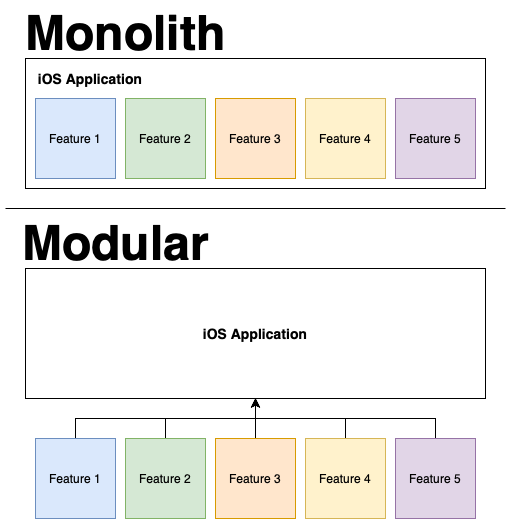
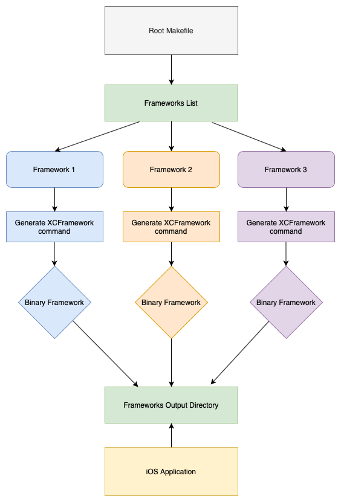

# XCFrameworks Example

A simple example to demonstrate how to use XCFrameworks and generate them from a Makefile using a terminal.

The purpose of this text is to create an alternative to modularize an iOS Application, prevent Xcode to rebuild frameworks multiple times without necessity and reduce the build time. 

**If you have no problems with build time or large/heavy projects, this text will probably not help you.**

## Monolith vs. Modules
Before we start with binary frameworks and all stuff related, let's discuss about monoliths and modular applications.

Here's a simple representation of a monolith application with 5 features and a modular application with the same 5 features but as external references.

<p align="center">
    
</p>

*"Modular design, or modularity in design, is an approach (design theory and practice) that subdivides a system into smaller parts called modules, which can be independently created, modified, replaced or exchanged between different systems."*

### Monolith
Probably a giant **`.xcodeproj`** or **`.xcworkspace`** with a lot of features, files and all the stuff in a single place. Works well with small teams, but even in this case there's some problems: Conflicts in **`.pbxproj`**  file, a longer build time, issues with a single software architecture, technical debts, difficulties to test...

### Modular
A modular project can have several levels of modularization. This can significantly increase the complexity of the structure, but it helps you in other ways: less conflicts in **`.pbxproj`**  file, freedom to use different software architectures on each module, more testability, specific contexts, specific teams working on a single piece of project...

Q: Does this mean that a modular project is better than a monolith project?
<br/>
A: **No.**

Q: Modular concept is a silver bullet that will solve all your problems and will make you a billionaire?
<br/>
A: **No.**

Q: Should I migrate my monolith project to a modular architecture right now without validate the risks?
<br/>
A: **Of course not.**

**This is just an alternative for large projects that are struggling to evolve. This may not work due to several particular problems related to the project, company or context.**

## Generating frameworks
To generate the XCFrameworks for the main project, run the following command in your terminal:
```
$ make build-all
```

The command **`build-all`** will loop through a frameworks directories list and run the subfolders Makefile command to build the binary framework for iOS and Simulator platforms.

If you add more frameworks to your project, you'll need to update the directories list to increment the loop.

If you need to test all frameworks together in the main project, go back to root directory and run the **`build-all`** command again.

The command output will locate the XCFramework files at `frameworks` directory. You can change anything you want (rename directories or files, change the output destination, etc...).

<p align="center">
    
</p>

## How can I use this in real life?
The main idea of this concept is to only use the binary version of each framework, preventing the Xcode to rebuild all frameworks again without a real necessity.

In a team with others developers, it's recommended to separate your application in multiple frameworks, even in a feature level separation, if needed.
By separating your features in frameworks, teams will work with specific pieces of your project, improving the performance, testability and speed of work.

After all, the main project will only has a single responsability: be the center of all generated frameworks.

Theoretically, the other teams will not work with the main project directly. Instead, a specific team (deploy team, architecture team, base team or something similar) will be in charge to gather all frameworks, mount the structure, connect the features and ship the final archive to the App Store, for example.

## Final considerations

This is a simple way to keep your large or heavy project organized, clean and with a fast build time. Of course, you can use CocoaPods or Carthage to generate modules and distribute for your coleegues, but here I mantain the original alternative provided by Apple. 

Please, feel free to send suggestions, corrections and improvements to this example.

Thanks for reading. ♥️